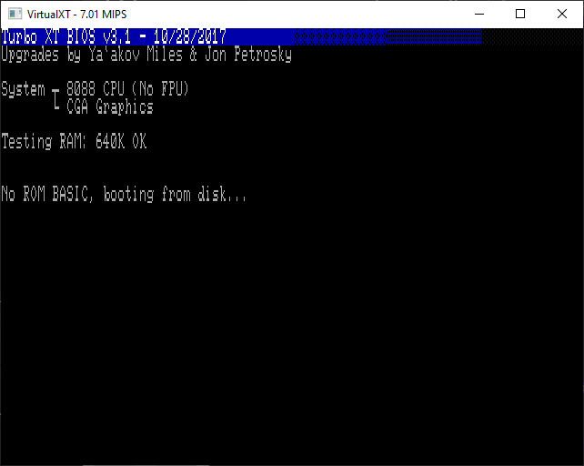
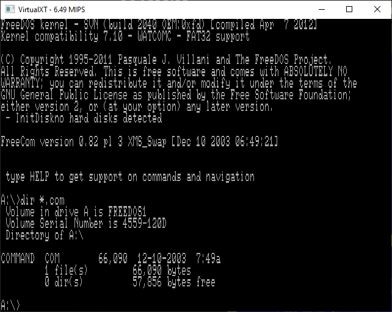
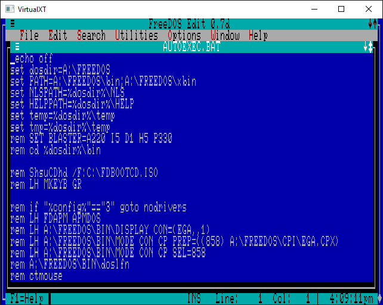
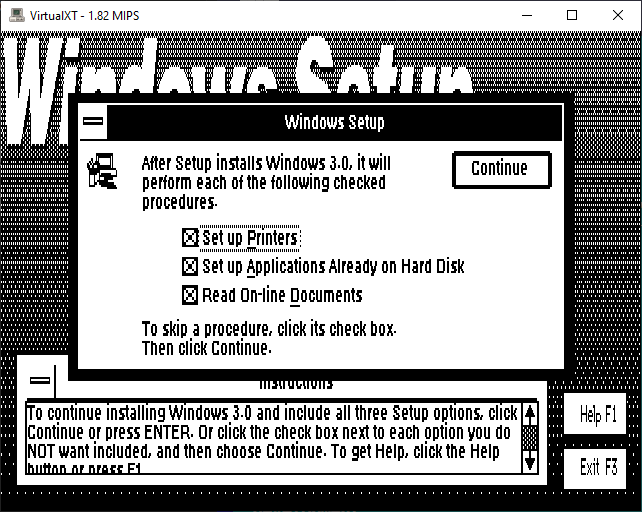
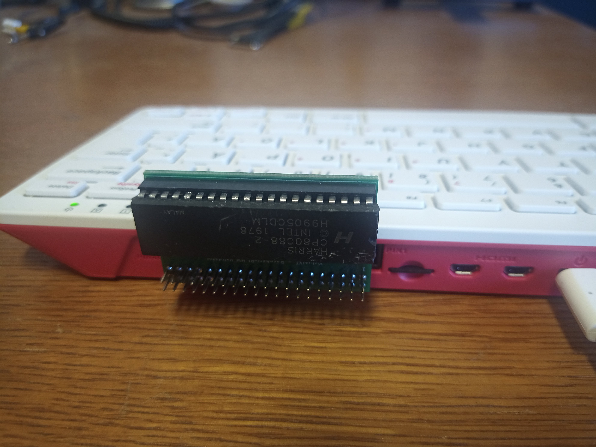

# virtualxt

[](https://github.com/andreas-jonsson/virtualxt/actions/workflows/ci.yml)
[](https://codecov.io/gh/andreas-jonsson/virtualxt)
[](https://matrix.to/#/#virtualxt:matrix.org)
[](https://www.vogons.org/viewforum.php?f=9)
[](https://issuehunt.io/r/andreas-jonsson/virtualxt)

VirtualXT is a IBM PC/XT (8088/V20) emulator that runs on modern hardware and operating systems.
It is designed to be simple and lightweight yet still capable enough to run a large
library of old application and games.

## Features

* Intel 8088 or NEC V20 CPU
* 1MB RAM
* CGA/HGC compatible graphics
* Turbo XT BIOS 3.1 + VXTX
* Keyboard controller with 83-key XT-style keyboard
* Serial port with Microsoft 2-button mouse
* Floppy and hard disk controller
* AdLib Music Synthesizer
* Ethernet adapter
* Real Time Clock
* PC speaker

## Screenshots










## Build

The emulator is written in C11 and should be compiled with the [Zig](https://ziglang.org/) toolchain.
You also need to have [SDL2](https://www.libsdl.org/) installed on your system or pass `-Dsdl_path=<path to lib>` to the compiler.

```
git clone https://github.com/andreas-jonsson/virtualxt.git
cd virtualxt
zig build run -Drelease-fast
```

You can download pre-built binaries from [itch.io](https://phix.itch.io/virtualxt/purchase). OSX and Linux users can also download VirtualXT using [Homebrew](https://brew.sh).

```
brew tap andreas-jonsson/virtualxt
brew install virtualxt
```

If you want to embed the emulator or create a custom frontend you can find libvxt API documentation [here](https://andreas-jonsson.github.io/virtualxt).

## Validation

A hardware validator was developed to ensure proper CPU behaviour.
Some additional information about that can be found [here](https://hackaday.io/project/184209-virtualxt-hardware-validator).


